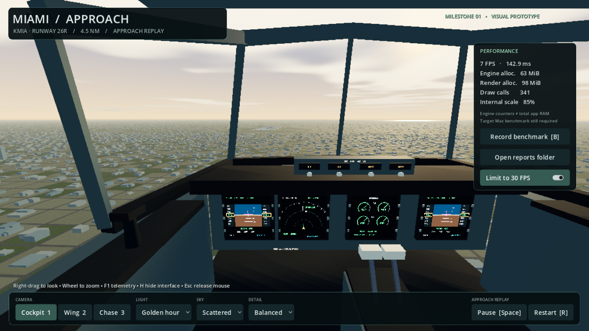
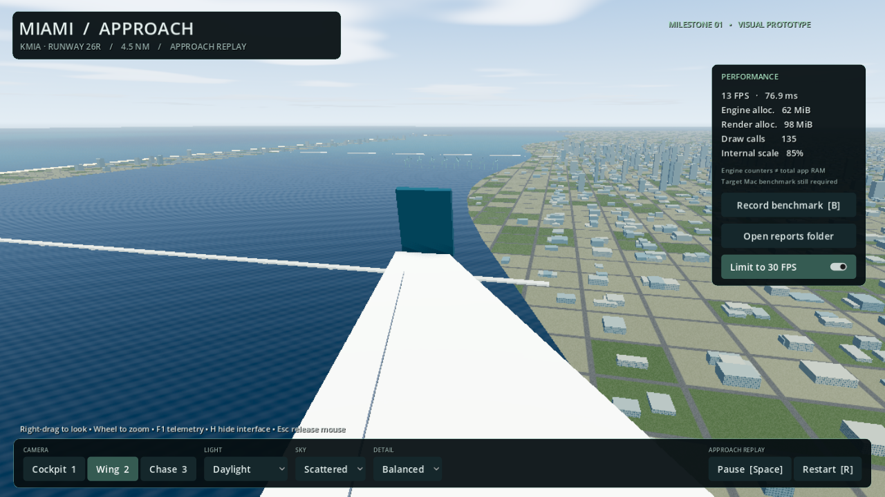

# Miami visual prototype: review build

Implementation approved by the user on 10 September 2026. This change belongs
only to `ftrap2030/Flight_Sim_GPT`; the original `Flight_Sim` repository remains
untouched. The inherited Python flight model is unchanged.

## What is ready to review

- A standalone Godot 4.5.1 project and a reproducible Mac app export.
- Procedural cockpit with four live preview displays, original exterior, and
  cockpit, wing, and chase cameras with mouse look and zoom.
- Four KMIA runway pairs from the bundled OurAirports coordinates, an automatic
  26R approach replay, coastline and bay proxies, instanced city buildings,
  airport proxies, bridges, port cranes, water, haze and clouds.
- Three lighting, weather and detail presets; pause/restart; benchmark reports.
- No paid assets or runtime network dependencies.

The flight model is not connected yet. Instruments show replay values, not
fully functioning avionics. There is no manual flight, touchdown, controller
support, audio, terrain streaming, or surveyed city reconstruction in this build.

## Evidence and remaining gates

| Check | Result |
| --- | --- |
| Godot 4.5.1 import and full-scene smoke test | Passed on Linux |
| Cameras, detail/light/weather presets, pause/restart, benchmark calculations and file output | Passed |
| Rendered cockpit, wing and chase views | Inspected on Mobile renderer, Vulkan software device |
| macOS release export | Built with Godot's built-in ad-hoc signing |
| Mac ZIP CRC, bundle ID, executable permissions, arm64/x86_64 slices and project pack | Passed |
| macOS packaging and headless launch | Added as required checks for the Mac-Verified artifact following the reported Archive Utility failure |
| Metal appearance on macOS | Not tested |
| 8 GB M1 performance and memory over 20 minutes | Not tested; required for milestone acceptance |
| Photorealistic art finish | Not achieved; current assets establish the scene and material workflow |

The screenshots below are actual engine frames from a Linux software renderer.
The FPS and allocation counters shown are **not M1 measurements** and are not
an application RAM benchmark. Screenshot dimensions are 1280×720 with Balanced
rendering. [Mac setup and controls](../godot/README.md).

### Cockpit, golden hour

### Wing, daylight

### Chase, blue hour

## Next decision

Use the exported app on the target Mac before expanding the map. Record the
benchmark and system memory pressure, and review cockpit visibility and the
art direction. Refine asset quality and scenery geography next; port the
Python flight model with reference comparisons in the flyable-approach stage.
Stage 1 remains awaiting hardware and visual acceptance, even though this
review build is implemented and packaged.

## Mac download correction

The first user download failed in Archive Utility with "unsupported format"
before the app could launch. The original ZIP passed Linux CRC and structure
checks; those checks were insufficient to establish extraction on macOS.
The build now adds a macOS job that uses Apple tools to package, extract and
verify the app, then executes its headless smoke test. Download the final
`Miami-Approach-Mac-Verified` artifact and open `Miami-Approach-Mac.zip` inside.
A headless launch check does not replace the target Mac's visual/performance run.
